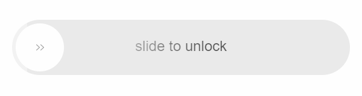

# @j2only/slide-unlock

  [](https://www.npmjs.com/package/@j2only/slide-unlock)   [](https://www.typescriptlang.org/) [](https://github.com/j2only/slide-unlock/issues)

Vue.js slide to unlock component. Protect users from accidental clicks or protect your web app from bot attack.
Written entirely on Vue 3 Composition API with Typescript and Vite. Coated with tests using Cypress. Compatible only with Vue.js 3.x.

You can check a [DEMO HERE](https://j2only.github.io/slide-unlock/)



## Test coverage

| Statements                                                                               | Branches                                                                             | Functions                                                                              | Lines                                                                          |
| ---------------------------------------------------------------------------------------- | ------------------------------------------------------------------------------------ | -------------------------------------------------------------------------------------- | ------------------------------------------------------------------------------ |
|  |  |  |  |

## Installation

Install this component via package manager:

```bash
yarn add @j2only/slide-unlock
```

or

```shell
npm install --save @j2only/slide-unlock
```

[](https://www.npmjs.com/package/@j2only/slide-unlock)

## Usage

Import the component in your app and pass some settings:

```javascript
<template>
    <slide-unlock
        ref="vueslideunlock"
        :auto-width="true"
        :circle="true"
        :width="400"
        :height="60"
        text="slide to unlock"
        success-text="success"
        name="slideunlock"
        @completed="complete()"
    />
</template>

<script>
import SlideUnlock from "@j2only/slide-unlock"

export default {
    components: {
        SlideUnlock
    }
}
</script>
```

As you can see, the component accepts some props:

| Prop        | Type    | Default           | Description                                                           |
| ----------- | ------- | ----------------- | --------------------------------------------------------------------- |
| autoWidth   | Boolean | true              | Auto width for component                                              |
| circle      | Boolean | true              | All parts of component will be with border-radius and rounded handler |
| disabled    | Boolean | false             | Disable interaction with component                                    |
| noanimate   | Boolean | false             | Disable css animations (but not css transitions)                      |
| width       | Number  | 400               | Width of element (ignored if autoWidth is true)                       |
| height      | Number  | 60                | Height of element                                                     |
| position    | Number  | 0                 | Progress percent (to emulate sliding)                                 |
| text        | String  | "slide to unlock" | Text on element                                                       |
| successText | String  | "success"         | Text on element when slide is completed                               |
| name        | String  | "slideunlock"     | Unique ID, in case of using several components on one page            |

Also, you can customize some styles via CSS Variables:

| Variable                        | Default | Description                                      |
| ------------------------------- | ------- | ------------------------------------------------ |
| --su-size-text                  | 24px    | Font size of text on element                     |
| --su-size-padding               | 6px     | Padding on element from progressbar              |
| --su-color-bg                   | #ebebeb | Background color of element.                     |
| --su-color-progress-normal-bg   | #cacaca | Color of progressbar                             |
| --su-color-progress-complete-bg | #42b983 | Color of progressbar when slide is completed     |
| --su-color-text-normal          | #4F4F4F | Color of text on element                         |
| --su-color-text-complete        | #FEFEFE | Color of text on element when slide is completed |
| --su-color-handler-bg           | #FFFFFF | Color of handler                                 |
| --su-icon-handler               | base64  | Icon of handler                                  |

## Events

```javascript
<template>
    <slide-unlock ... @completed="alert('Unlocked!')" />
</template>
```

Emitted when pass verify, the handler swiped to the right side.

## Reset state

If you want to reset the state of a component, you need to assign a ref to the component

```javascript
<template>
    <slide-unlock ref="vueSlideUnlockRef" />
</template>
```

And then you need to call the "reset" method

```javascript
const vueSlideUnlockRef = ref()

const resetComponent = () => {
    vueSlideUnlockRef.value.reset()
}
```

## Completed state

If you want to get the сompleted state of a component, you need to call the "complete" method

```javascript
const unlockComponent = () => {
    vueSlideUnlockRef.value.complete()
}
```

## Licensing

MIT License
